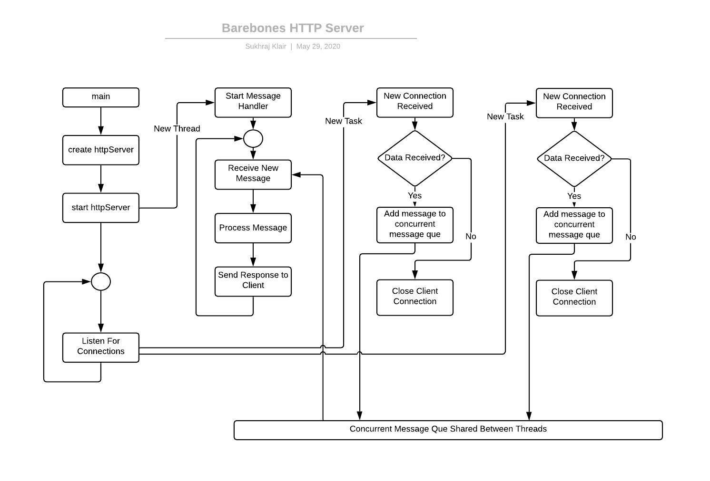

# Barebones HTTP Server
This project implements a bare-bones http server. It responds to the http requests coming over TCP/IP with appropriate resources or error messages. 

# Architecture
This program uses multi-thread design. Main thread creates a socket and listens for connections. A new task is started for each new connection. Requests from all of the connections are pushed into a concurrent message que. A message handler runs in a separate thread which receives messages from the message que in First-In-First-Out manner and responds to those messages. 

# Build/Install
1. Clone this repository from https://github.com/sukhrajklair/BarebonesHTTPServer-CPP.git
2. Go to the project directory
3. Use "make build" command to create an executable
   
# Run
1. From project directory, use "build/web_server 127.0.0.1 54000" command to start the server. You should get a message in console saying "listening on ip:127.0.0.1 and port:54000"
2. Go to a web browser and type this url: "http:localhost:54000". You will receive the index.html page in your web browser.
3. The project contains some static pages by default. You can replace them with your own.